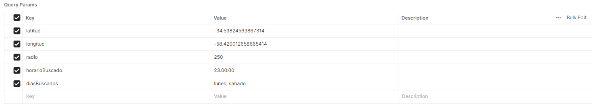

# Recomendador de Puntos de Donación - API REST


## Documentación
La documentación de la API Recomendadora de Puntos de Donación puede ser encontrada [acá](https://app.swaggerhub.com/apis/THGONZALEZ/API_Recomendacion_de_Puntos_de_Donacion/1.0.0)

## Descripción
Esta API expone un servicio REST para obtener un listado de los puntos de donación cercanos dentro de un radio específico, dado un punto con coordenadas de latitud y longitud. Esto servirá para extender la posibilidad de acercar donaciones a otras comunidades existentes.


## Parámetros de consulta (Query Parameters)


- `latitud` (requerido): La latitud del punto central desde el cual se hará la búsqueda.
  - **Ejemplo**: `-34.66291992043316`
- `longitud` (requerido): La longitud del punto central desde el cual se hará la búsqueda.
  - **Ejemplo**: `-58.46732181710551`
- `radio` (opcional): El radio en kilómetros dentro del cual se buscarán los puntos de donación. En caso de no ingresar ninguno, se tomará un radio de 5km por defecto.
  - **Ejemplo**: `1` (para un radio de 1 km)
- `horarioBuscado` (opcional): El horario específico dentro del cual se buscarán los puntos de donación que estén disponibles. 
  - **Ejemplo**: `17.30.00`
- `díasBuscados` (opcional): Días específicos dentro de los cuales se buscarán los puntos de donación que estén disponibles en al menos uno de esos días. 
  - **Ejemplo**: `lunes, martes, sabado`

## Ejemplo de solicitud con radio predeterminado

```bash
GET http://localhost:7000/api/recomendadorDePuntos?latitud=-34.66291992043316&longitud=-58.46732181710551
```

## Ejemplo de solicitud con radio específico

```bash
GET http://localhost:7000/api/recomendadorDePuntos?latitud=-34.66291992043316&longitud=-58.46732181710551&radio=1000
```

## Ejemplo de solicitud con radio específico y horario específico

```bash
GET http://localhost:7000/api/recomendadorDePuntos?latitud=-34.59824563867314&longitud=-58.420012658665414&radio=250&horarioBuscado=23.00.00
```

## Ejemplo de solicitud con radio específico y días
```bash
GET http://localhost:7000/api/recomendadorDePuntos?latitud=-34.59824563867314&longitud=-58.420012658665414&radio=250&diasBuscados=lunes
```

## Ejemplo de solicitud con radio específico, horario específico y días
```bash
GET http://localhost:7000/api/recomendadorDePuntos?latitud=-34.59824563867314&longitud=-58.420012658665414&radio=250&horarioBuscado=23.00.00&diasBuscados=lunes
```

## Ejemplo de respuesta esperada
```bash
[
    {
        "activo": true,
        "nombre": "UTN Medrano",
        "puntoGeografico": {
            "latitud": -34.598245638673,
            "longitud": -58.420012658665
        },
        "horaApertura": [
            10,
            0
        ],
        "horaCierre": [
            18,
            0
        ],
        "diasAbierto": [
            "MONDAY",
            "TUESDAY",
            "WEDNESDAY",
            "MONDAY",
            "TUESDAY",
            "WEDNESDAY",
            "THURSDAY",
            "FRIDAY"
        ],
        "id": 1
    },
    {
        "activo": true,
        "nombre": "UTN Pacheco",
        "puntoGeografico": {
            "latitud": -34.455130586427,
            "longitud": -58.624240247031
        },
        "horaApertura": [
            0,
            0
        ],
        "horaCierre": [
            23,
            59
        ],
        "diasAbierto": [
            "SATURDAY",
            "SUNDAY"
        ],
        "id": 3
    }
]
```

## Guía de despliegue local

### Requisitos Previos
- **Java JDK** (preferiblemente versión 8 o superior).
- **IDE**: IntelliJ IDEA, Eclipse, o NetBeans.
- **MySQL**: Asegúrate de que MySQL esté instalado y en ejecución.

### Pasos para el Despliegue
#### 1. Crear la Base de Datos
1. Abre tu cliente MySQL (puede ser MySQL Workbench o la línea de comandos).
2. Ejecuta el siguiente comando SQL para crear la base de datos:

```sql
CREATE DATABASE puntosDeDonacionDB;
```

#### 2. Modificar el `persistence.xml`
  1. Navega a la carpeta `src/main/resources` de tu proyecto.
  2. Abre el archivo `persistence.xml` y asegúrate de que las configuraciones de la base de datos estén correctas. Aquí tienes un ejemplo modificado:

   ```xml
     <?xml version="1.0" encoding="UTF-8"?>
     <persistence xmlns="http://java.sun.com/xml/ns/persistence"
                  xmlns:xsi="http://www.w3.org/2001/XMLSchema-instance"
                  xsi:schemaLocation="http://java.sun.com/xml/ns/persistence
        http://java.sun.com/xml/ns/persistence/persistence_2_0.xsd"
                  version="2.0">
   
         <persistence-unit name="simple-persistence-unit" transaction-type="RESOURCE_LOCAL">
             <provider>org.hibernate.jpa.HibernatePersistenceProvider</provider>
   
             <properties>
                 <property name="hibernate.archive.autodetection" value="class"/>
                 <property name="hibernate.connection.driver_class" value="com.mysql.jdbc.Driver" />
                 <property name="hibernate.connection.url" value="jdbc:mysql://localhost:3306/puntosDeDonacionDB?serverTimezone=America/Argentina/Buenos_Aires" />
                 <property name="hibernate.connection.username" value="root" />
                 <property name="hibernate.connection.password" value="mysql" />
                 <property name="hibernate.show_sql" value="true"/>
                 <property name="hibernate.format_sql" value="true"/>
                 <property name="use_sql_comments" value="true"/>
                 <property name="hibernate.hbm2ddl.auto" value="update"/>
             </properties>
   
         </persistence-unit>
     </persistence>
```
#### 3. Cargar los Puntos de Donación
  1. Crea una clase para cargar los puntos de donación en la base de datos. Usa el siguiente código:

   ```java
   public class CargaDePuntosBD implements WithSimplePersistenceUnit {

       public static void main(String[] args) {
           RepositorioPuntosDonacion repositorioPuntosDonacion = RepositorioPuntosDonacion.builder().build();
           CargaDePuntosBD mainExample = new CargaDePuntosBD();
           mainExample.guardarPuntosDonaciones(repositorioPuntosDonacion);
       }

       private void guardarPuntosDonaciones(IRepositorioPuntosDonacion repositorioPuntosDonacion) {
           List<DayOfWeek> diasAbierto1 = List.of(DayOfWeek.MONDAY, DayOfWeek.TUESDAY, DayOfWeek.WEDNESDAY);
           List<DayOfWeek> diasAbierto2 = List.of(DayOfWeek.MONDAY, DayOfWeek.TUESDAY, DayOfWeek.WEDNESDAY, DayOfWeek.THURSDAY, DayOfWeek.FRIDAY);
           List<DayOfWeek> diasAbierto3 = List.of(DayOfWeek.SATURDAY, DayOfWeek.SUNDAY);

           PuntoDeDonacion puntoDeDonacion1 = PuntoDeDonacion.builder()
               .nombre("UTN Medrano")
               .puntoGeografico(PuntoGeografico.builder().longitud(-58.420012658665414).latitud(-34.59824563867314).build())
               .diasAbierto(diasAbierto1)
               .horaCierre(LocalTime.of(18, 0))
               .horaApertura(LocalTime.of(10, 0))
               .build();

           PuntoDeDonacion puntoDeDonacion2 = PuntoDeDonacion.builder()
               .nombre("UTN Lugano")
               .puntoGeografico(PuntoGeografico.builder().longitud(-58.46798633167874).latitud(-34.65938494882818).build())
               .diasAbierto(diasAbierto2)
               .horaCierre(LocalTime.of(12, 0))
               .horaApertura(LocalTime.of(8, 0))
               .build();

           PuntoDeDonacion puntoDeDonacion3 = PuntoDeDonacion.builder()
               .nombre("UTN Pacheco")
               .puntoGeografico(PuntoGeografico.builder().longitud(-58.62424024703083).latitud(-34.455130586426726).build())
               .diasAbierto(diasAbierto3)
               .horaCierre(LocalTime.of(23, 59))
               .horaApertura(LocalTime.of(0, 0))
               .build();

           withTransaction(() -> {
               repositorioPuntosDonacion.guardar(puntoDeDonacion1);
               repositorioPuntosDonacion.guardar(puntoDeDonacion2);
               repositorioPuntosDonacion.guardar(puntoDeDonacion3);
           });
       }
   }
```

  2. Agrega los distintos puntos de donacion al código y ejecuta el `main` de esta clase para cargar los puntos de donación en la base de datos.

#### 4. Levantar el Servidor
  1. Crea una clase para iniciar el servidor:

     ```java
     public class RecomendacionDePuntosMain implements WithSimplePersistenceUnit {

         public static void main(String[] args) {
             EncendidoSeguro.inicializar();
             RecomendadorDePuntosDonacionesDonacionesService recomendadorDePuntosDonacionesService = RecomendadorDePuntosDonacionesDonacionesService.builder().build();
             Javalin app = Javalin.create().start(7000);
             new RecomendadorDePuntosDonacionesController(app, recomendadorDePuntosDonacionesService);
         }
     }

  2. Ejecuta el `main` de esta clase. El servidor debería estar corriendo en `http://localhost:7000`.

#### Conclusión
Ahora tienes tu servicio de puntos de donación corriendo localmente. Puedes acceder a él y empezar a utilizar las funcionalidades implementadas. ¡Éxito en tu proyecto!
