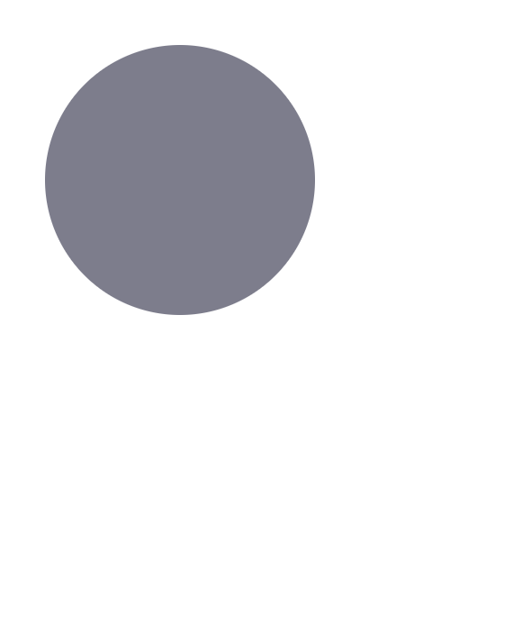
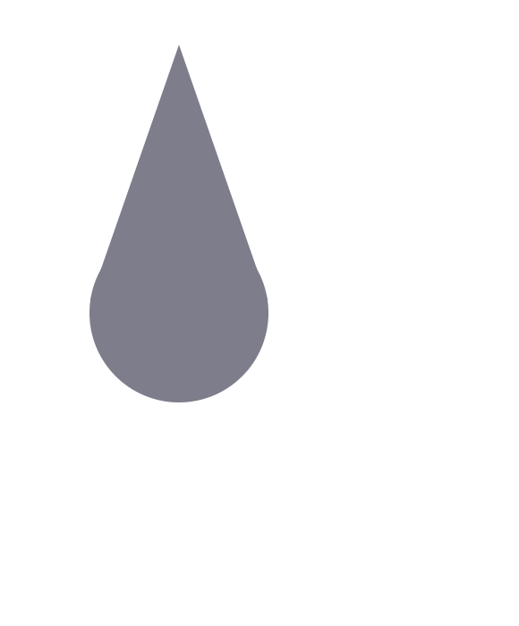
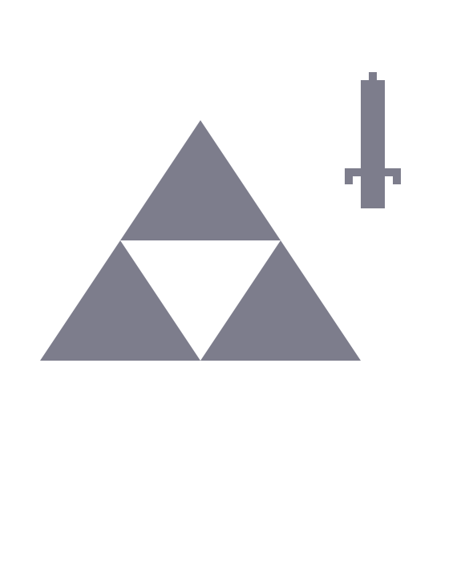
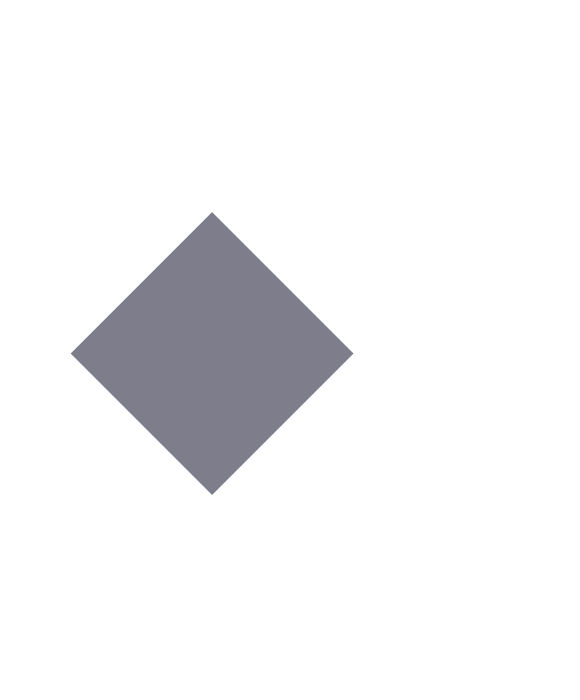
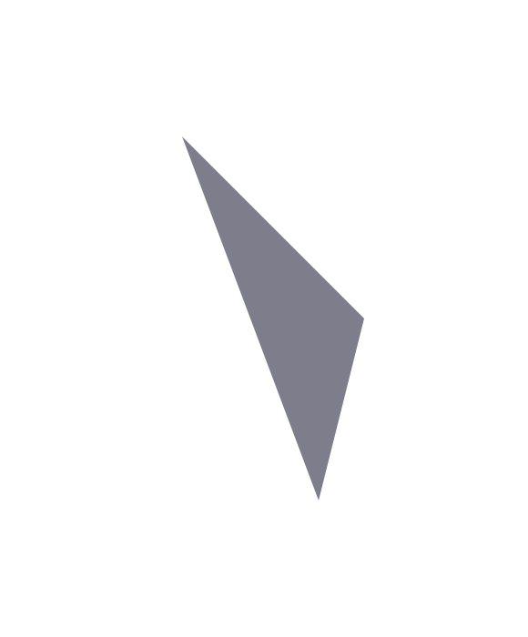

# Procesador de Imagenes

## 📌 Descripción
Este proyecto consiste en la implementación de **Parser Combinators** para la interpretación de un lenguaje de descripción de imágenes. Utilizando un enfoque híbrido objeto-funcional, se busca desarrollar parsers que conviertan textos en representaciones estructuradas, permitiendo su manipulación y posterior renderizado mediante una API de dibujo.

---

## 🛠️ Tecnologías y Conceptos Aplicados

### Tecnologías
- **Scala**: Lenguaje de programación utilizado.
- **Paradigma Funcional**: Uso de funciones de orden superior, inmutabilidad y pattern matching.
- **Paradigma Orientado a Objetos**: Modelado de entidades mediante clases y polimorfismo.
- **Parser Combinators**: Construcción modular de parsers utilizando combinadores.
- **AST (Abstract Syntax Tree)**: Representación estructurada de las imágenes.
- **Manipulación y Optimización del AST**: Simplificación de transformaciones redundantes.
- **Interfaz de Dibujo**: Uso de `TADPDrawingAdapter` para renderizar imágenes.

---

## 📌 Funcionalidades Implementadas

### 🏗️ Parsers Básicos
Se implementan parsers para reconocer distintos elementos del lenguaje:
- `anyChar`: Captura cualquier carácter.
- `char(c)`: Captura un carácter específico.
- `digit`: Captura un número del 0 al 9.
- `string(s)`: Captura una cadena de texto específica.
- `integer`: Captura números enteros positivos o negativos.
- `double`: Captura números decimales.

### 🔗 Combinadores de Parsers
- `p1 <|> p2`: Prueba el primer parser y, en caso de fallo, prueba el segundo.
- `p1 <> p2`: Ejecuta dos parsers secuencialmente y devuelve ambos resultados.
- `p1 ~> p2`: Ejecuta dos parsers secuencialmente y devuelve solo el resultado del segundo.
- `p1 <~ p2`: Ejecuta dos parsers secuencialmente y devuelve solo el resultado del primero.
- `sepBy(p, sep)`: Permite parsear múltiples elementos separados por un separador.

---

## 🖼️ Parser de Imágenes
Se implementa un parser que traduce el lenguaje de descripción de imágenes a un **AST**, permitiendo reconocer:

### Figuras

#### Triángulo
```txt
triangulo[0 @ 100, 200 @ 300, 150 @ 500]
```


#### Rectángulo
```txt
rectangulo[0 @ 100, 200 @ 300]
```


#### Círculo
```txt
circulo[100 @ 100, 50]
```


### Agrupaciones

#### Grupo de Figuras
```txt
grupo(
   triangulo[200 @ 50, 101 @ 335, 299 @ 335],
   circulo[200 @ 350, 100]
)
```


#### Grupo Anidado
```txt
grupo(
    grupo(
     triangulo[250 @ 150, 150 @ 300, 350 @ 300],
     triangulo[150 @ 300, 50 @ 450, 250 @ 450],
     triangulo[350 @ 300, 250 @ 450, 450 @ 450]
    ),
    grupo(
     rectangulo[460 @ 90, 470 @ 100],
     rectangulo[430 @ 210, 500 @ 220]
    )
)
```


### Transformaciones

#### Color
```txt
color[60, 150, 200](
    grupo(
     triangulo[200 @ 50, 101 @ 335, 299 @ 335],
     circulo[200 @ 350, 100]
    )
)
```


#### Escala
```txt
escala[2.5, 1](
 rectangulo[0 @ 100, 200 @ 300]
)
```


#### Rotación
```txt
rotacion[45](
 rectangulo[300 @ 0, 500 @ 200]
)
```


#### Traslación
```txt
traslacion[200, 50](
 triangulo[0 @ 100, 200 @ 300, 150 @ 500]
)
```


---

## 📏 Optimización del AST
Se aplican reglas de simplificación, tales como:
- Consolidación de transformaciones anidadas.
- Eliminación de transformaciones redundantes.
- Conversión de transformaciones individuales en transformaciones de grupo.

---

## 🎨 Renderizado de Imágenes
Se implementa un **intérprete del AST** que utiliza la API `TADPDrawingAdapter` para dibujar la imagen resultante en:
- **Pantalla (`forScreen`)**.
- **Archivo (`forImage`)**.
- **Interfaz interactiva (`forInteractiveScreen`)**.

Ejemplo de uso:
```scala
TADPDrawingAdapter.forScreen { adapter =>
  adapter.beginColor(Color.rgb(100, 100, 100))
    .rectangle((200, 200), (300, 400))
    .end()
}
```

---

## 🚀 Ejecución
Para ejecutar el parser y visualizar los resultados:
1. **Ejecutar los tests**:
   ```sh
   sbt test
   ```
2. **Ejecutar el intérprete** y renderizar una imagen:
   ```sh
   sbt run
   ```

---

## 📸 Ejemplos de Resultados
_Agregar capturas de pantalla de imágenes generadas_

---

## 📜 Licencia
Este proyecto es de código abierto y puede utilizarse con fines académicos y educativos.

