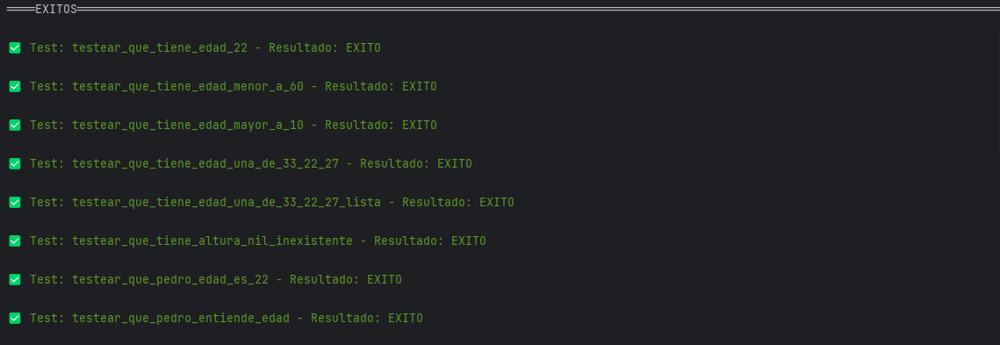
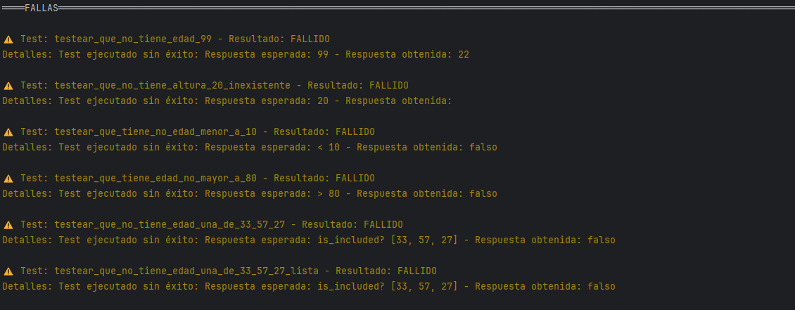
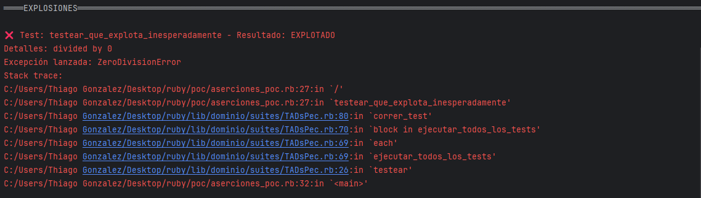
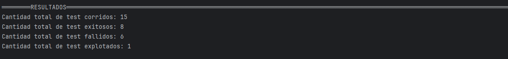

# TADsSpec - Framework de Testing en Ruby

## Descripción
TADsSpec es un framework de testeo desarrollado en Ruby que permite realizar pruebas utilizando un DSL intuitivo y flexible. Su objetivo es facilitar la verificación de postcondiciones dentro de tests, ofreciendo aserciones expresivas y herramientas para mocks y spies.

Este framework se construyó aplicando conceptos de metaprogramación y buenas prácticas de diseño, garantizando una sintaxis limpia y extensible.

---

## Características principales

### Aserciones
- `ser`: Verifica igualdad de valores.
- `ser_igual`: Compara estrictamente valores.
- `ser mayor_a` / `ser menor_a`: Compara rangos de valores.
- `ser uno_de_estos`: Verifica si un valor está dentro de una lista.
- `tener_<atributo>`: Comprueba el estado interno de un objeto.
- `entender`: Valida si un objeto responde a un mensaje.
- `explotar_con`: Testea que un bloque lance una excepción esperada.

### Tests y Suites
- Los tests son métodos cuyo nombre comienza con `testear_que_`.
- Los tests se agrupan en suites representadas por clases.
- Se pueden ejecutar tests individuales, suites completas o todas las suites en contexto.
- Resultados posibles:
  - **Test pasado** ✅
  - **Test fallido** ❌
  - **Test explotado** 💥

### Mocking y Spying
- `mockear`: Reemplaza temporalmente la implementación de un método dentro de un test, permitiendo simular su comportamiento sin afectar el código original.
- `espiar(objeto)`: Permite inspeccionar los mensajes recibidos por un objeto durante un test sin modificar su funcionalidad.
- `haber_recibido`: Verifica que un objeto espiado haya recibido ciertos mensajes, permitiendo además chequear argumentos y cantidad de llamadas.

#### Uso de Mocks
El método `mockear` se usa para reemplazar la implementación de un método de forma temporal. Esto es útil cuando queremos evitar ejecutar lógica costosa o dependencias externas.

```ruby
class PersonaHome
  def todas_las_personas
    # Este método normalmente consultaría una base de datos
  end
end

class PersonaHomeTest
  def testear_mocking
    PersonaHome.mockear(:todas_las_personas) do
      [Persona.new(30), Persona.new(22)]
    end

    resultado = PersonaHome.new.todas_las_personas
    resultado.deberia ser [Persona.new(30), Persona.new(22)]
  end
end
```

#### Uso de Spies
El método `espiar(objeto)` se usa para monitorear la interacción con un objeto sin alterar su comportamiento.

```ruby
class Usuario
  def iniciar_sesion(usuario, clave)
    autenticar(usuario, clave)
  end
  
  def autenticar(usuario, clave)
    # Lógica de autenticación
  end
end

usuario = Usuario.new
usuario_espiado = espiar(usuario)
usuario_espiado.iniciar_sesion("admin", "1234")

usuario_espiado.deberia haber_recibido(:autenticar).con_argumentos("admin", "1234")
```

---

## Tecnologías y Conceptos Utilizados

### Tecnologías
- **Ruby**: Lenguaje de programación dinámico y orientado a objetos.
- **Metaprogramación en Ruby**: Uso de `method_missing`, refinements y evaluación dinámica de código.
- **DSLs (Domain-Specific Languages)**: Implementación de una sintaxis amigable para definir aserciones de testeo.
- **Mocks y Spies**: Simulación de dependencias y monitoreo de interacciones en objetos.

### Conceptos Claves
- **Testing Automatizado**: Ejecución de pruebas sin intervención manual para validar el comportamiento del código.
- **Inversión de Control**: Uso de técnicas como mocking para desacoplar dependencias.
- **Diseño Orientado a Objetos**: Aplicación de encapsulación y polimorfismo para estructurar el framework.
- **Patrones de Diseño**: Implementación de estrategias como el patrón Proxy en spies y mocks.

---

## Ejemplo de Uso

```ruby
class Persona
  attr_accessor :edad
  def viejo?
    @edad > 29
  end
end

class PersonaTest
  def testear_que_una_persona_es_vieja
    persona = Persona.new
    persona.edad = 30
    persona.deberia ser_viejo
  end
end
```

---

## Resultados de Test
_Agrega aquí capturas de pantalla de los distintos resultados de los tests._

### Test Pasado ✅

### Test Fallido ❌


### Test Explotado 💥


### Resumen de la Suite 📊

_Agregar imagen mostrando cantidad de tests corridos, pasados, fallidos y explotados_

---

## Ejecución
Ejecutar todos los tests:
```sh
TADsSpec.testear
```

Ejecutar una suite en particular:
```sh
TADsSpec.testear MiSuite
```

Ejecutar un test específico:
```sh
TADsSpec.testear MiSuite, :testear_que_una_persona_es_vieja
```

---

## Contribución
El framework está diseñado para ser extensible. Puedes agregar nuevas aserciones y funcionalidades utilizando la metaprogramación de Ruby.

Si tienes sugerencias o mejoras, ¡serán bienvenidas!

---

## Licencia
Este proyecto es de código abierto y puede utilizarse libremente para fines académicos o profesionales.


